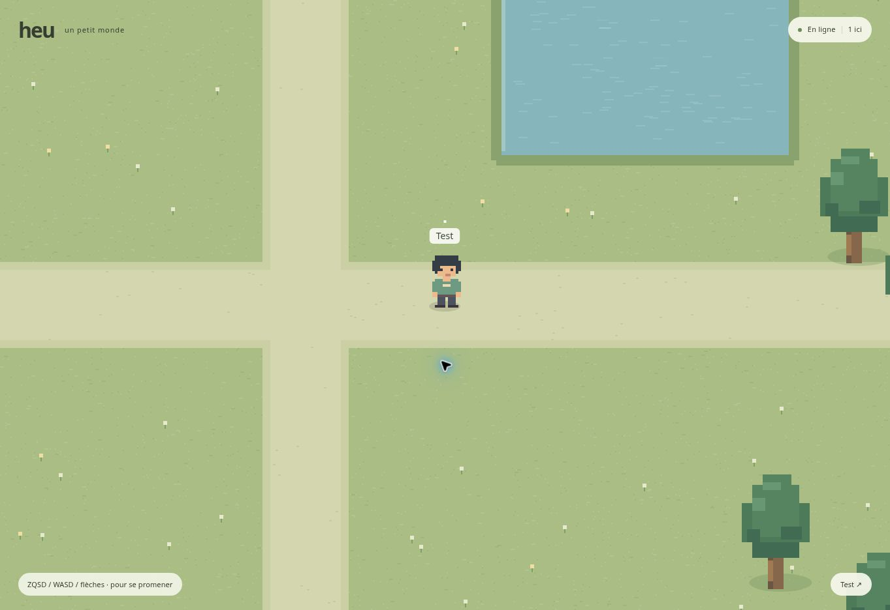

# heu

**Jouer : https://heu-uqsr.onrender.com/**

Ouvrez cette même adresse avec vos amis. Rien à installer ni à lancer sur vos postes.



Un petit monde partagé, dans le navigateur. Choisissez un pseudo et retrouvez-vous sur la même carte. Aucun compte, aucun salon à créer, aucune règle de jeu.

## Pour jouer

Ouvrez l'adresse du service avec votre ami. Votre pseudo est demandé une seule fois et enregistré dans ce navigateur. Déplacements avec ZQSD, WASD, les flèches ou le joystick tactile. Cliquez sur votre pseudo pour le changer.

La dernière position est enregistrée régulièrement. Un rafraîchissement rejoint directement le monde. Si vous ouvrez deux onglets sur le même navigateur, le dernier reprend votre personnage.

## Architecture

- **Client :** TypeScript, Canvas 2D, sprites originaux animés en pixel art ; esbuild produit un petit fichier JavaScript.
- **Serveur :** Node.js 24 et WebSocket (`ws`), simulation à 40 Hz, état envoyé à 20 Hz, déplacements contrôlés par le serveur.
- **Monde :** une seule carte, un seul processus, une seule réplique. Pas de base de données pour cette première version.
- **Fluidité :** déplacement local immédiat, correction progressive, interpolation des autres joueurs et caméra amortie.
- **Identité :** identifiant aléatoire et pseudo enregistrés en local, sans authentification. Le pseudo ne prouve pas l'identité d'une personne.

```
client/     interface, connexion, commandes et rendu
server/     HTTP, WebSocket et simulation du monde
shared/     carte, déplacements et types du protocole
assets/     sprites originaux, générés dans un atlas Canvas
scripts/    préparation des fichiers servis
tests/      déplacements et session multijoueur réelle
```

## Déploiement gratuit sur Render

[Déployer heu sur Render](https://render.com/deploy?repo=https://github.com/tdi-rosa/heu)

Le fichier `render.yaml` prépare un unique service **Free**, en Europe, connecté à `main`. Aucune variable secrète, base de données ou installation sur les postes des joueurs. Une fois le service lancé, partager son adresse HTTPS avec les amis.

Avec une connexion au fournisseur Git, chaque commit sur `main` peut déclencher le build et le déploiement. Le service actuel a été créé depuis l’URL publique du dépôt : les mises à jour sont donc déclenchées avec le connecteur Render après le commit. Le client utilise le SHA de la version Render pour recharger les pages après une mise à jour, tout en gardant le pseudo et la dernière position dans le navigateur.

Le service gratuit s'endort après 15 minutes sans trafic entrant. Son réveil prend environ une minute. Les messages WebSocket des joueurs le maintiennent actif pendant la partie. Les quotas gratuits de Render s'appliquent ; ne sélectionner aucune offre payante.

## Déploiement Railway (alternative)

Créer un service depuis le dépôt `tdi-rosa/heu`, branche `main`, puis générer un domaine public. `railway.toml` configure le build, le démarrage et `/health`. Node 24 est défini dans `package.json`. Le port est fourni par Railway. Aucune clé ni variable secrète n'est nécessaire.

Garder **une seule réplique**, sans mise en veille. Régler l'overlap des déploiements à **0 seconde** : deux processus simultanés feraient deux mondes indépendants. Le nouveau serveur est vérifié par `/health` avant la bascule.

Activer les déploiements automatiques depuis `main`. Chaque push reconstruit le service. Les réponses HTTP utilisent `Cache-Control: no-store`. Le client vérifie la version et se recharge après confirmation d'une nouvelle version ; il retrouve son pseudo et sa position. Une fermeture WebSocket provoque une reconnexion automatique avec temporisation.

Un déploiement peut provoquer une courte interruption. Les sessions actives ne sont pas transférées entre processus : chaque navigateur rejoint le nouveau serveur automatiquement. La position provient alors de la dernière sauvegarde locale. Aucune promesse de remplacement de code sans interruption.

## Développement (facultatif)

Les joueurs n'ont rien à lancer sur leur ordinateur. Ces commandes servent uniquement aux contributeurs :

```sh
npm ci
npm run build
npm test
npm run dev
```

Ouvrir `http://localhost:3000`. Après une modification du client, relancer `npm run build` puis rafraîchir. Le serveur se relance avec `--watch`.

## Sprites et portée

Les personnages utilisent un atlas de 3 poses × 4 directions inspiré des RPG en vue du dessus. Personnages, arbres et terrain sont originaux, écrits dans ce dépôt, sans ressources propriétaires de RPG Maker. Aucune image ni police n'est chargée depuis un service externe.

Cette version permet de rejoindre, choisir un pseudo, se déplacer, voir les autres et proposer une mise à jour avec le bouton « Une idée ? ». La carte comporte quelques éléments de décor avec collision. Il n'y a ni chat, ni combat, ni inventaire, ni objectif.

## Demandes de mises à jour

F (ou « 🔥 Feu » sur mobile) fait cracher un souffle de feu animé, visible par tous. Ce souffle est visuel et peut être lancé toutes les 1,2 secondes.

Maj (ou le bouton Sprint sur mobile) permet de courir 70 % plus vite. L’épée décrit un arc de cercle lors de l’attaque.

Chaque joueur possède une épée et 50 PV. Espace (ou « ⚔ Attaquer ») frappe à courte portée dans la direction regardée et retire 5 PV. À 0 PV, le personnage réapparaît au centre avec 50 PV.

Entrée (ou « Parler ↵ » sur mobile) ouvre une ligne de saisie. Entrée envoie le souhait, Échap ferme la ligne. Une bulle au-dessus du personnage est diffusée à tous immédiatement, pendant 7 à 18 secondes selon la longueur du texte. Chaque phrase propose aussi une modification du jeu. Le brouillon et les six dernières demandes sont conservés localement ; leur statut est consulté toutes les 5 secondes. Le serveur utilise le pseudo de la session active, transmet un commentaire à [la PR de réception](https://github.com/tdi-rosa/heu/pull/1). Les commentaires persistent sur GitHub, indépendamment des redémarrages Render. Les demandes et pseudos sont publics.

Une tâche ChatGPT Work intitulée « Demandes du jeu heu » est configurée sur les nouveaux commentaires de cette PR. Elle traite les demandes dans l’ordre et regroupe les changements compatibles dans une seule version : modification de main, tests, déploiement du service existant, puis mise à jour des commentaires originaux. Les bulles sont immédiates ; les changements de code dépendent du traitement IA et de la construction Render et prennent généralement quelques minutes, sans délai garanti. La branche `request-worker` sert de verrou avec une durée limitée pour éviter des modifications concurrentes. La PR `player-request-inbox` reste ouverte et n’est pas fusionnée. Les éditions de commentaires ne déclenchent pas la tâche.

### Activation unique côté hébergement

Le relais nécessite `HEU_GITHUB_TOKEN` dans les variables d’environnement du service Render. Créer un **jeton personnel à granularité fine**, limité au dépôt `tdi-rosa/heu`, permission **Pull requests: Read and write**, puis le coller uniquement dans le tableau de bord Render → Environment → Add environment variable. Utiliser un jeton personnel de compte humain : le déclencheur ChatGPT accepte les commentaires humains, pas ceux des bots. Le jeton n’est jamais envoyé au client et n’autorise pas le serveur à modifier le code. Renouveler le jeton avant son expiration. Aucun jeton OpenAI/API payante n’est nécessaire pour ce relais.

Sans cette variable, le serveur refuse l’envoi avec un message expliquant que l’activation manque ; il ne prétend jamais avoir livré la demande. Avec le jeton, le serveur confirme seulement l’écriture du commentaire, pas le démarrage de la tâche. Le statut « Modification en cours » confirme la prise en charge. La chaîne complète doit être testée après activation. Les limites sont 20 demandes par personnage et 120 demandes au total par heure. Ce sont des limites contre les clics répétés, pas une authentification des joueurs.

L’agent édite le JSON du commentaire initial en conservant son enveloppe :

~~~~text
[heu-request]
```json
{ "schema": 1, "id": "UUID", "name": "Pseudo", "text": "Demande", "status": "queued", "reply": "", "createdAt": "ISO-8601" }
```
~~~~

Statuts : `queued`, `processing`, `deployed`, `needs_info`, `declined`, `failed`. Après un déploiement réussi, `commit` contient le SHA et `reply` le résultat en français. Les mises à jour prennent quelques minutes selon la complexité, le lancement de la tâche et la durée du build ; le délai n’est pas garanti.

Jetpack : J ou le bouton 🚀 active un vol visuel partagé (24 pixels au-dessus du sol, réacteurs animés). Les obstacles restent actifs.

Personnages : sprites CC0 de Fleurman / GrafxKid (Tiny Characters Set), inclus localement. Voir assets/CREDITS.md. Grabolax est invisible pour les autres ; sa silhouette reste visible pour lui-même.

Lapins : L ou 🐇 invoque trois petits lapins (8 secondes, recharge 3 secondes). Ils poursuivent le joueur le plus proche, respectent les obstacles, infligent 10 dégâts au contact puis disparaissent. Aura de Grabolax : rayon 42 pixels, 10 dégâts/seconde aux autres joueurs. À 0 PV, retour au centre avec 50 PV.
